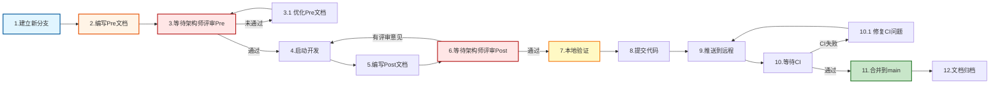
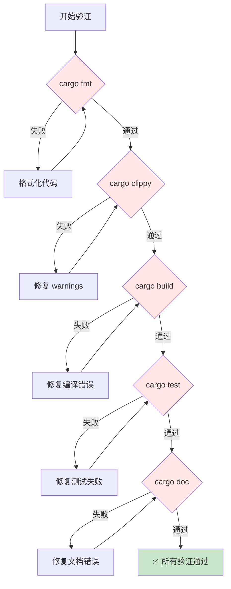

# LiteKV 开发流程规范

> **完整定义**：从需求到交付的 12 步 PR 工作流程
>
> **核心理念**：Pre-Post 双文档 + 用户评审 + 完整验证
>
> **技术栈**：Rust 1.81.0+ (MSRV)

---

## 📋 目录

1. [项目概述](#项目概述)
2. [AI 团队配置](#ai-团队配置)
3. [完整 12 步流程](#完整-12-步流程)
4. [文档规范](#文档规范)
5. [验证清单](#验证清单)
6. [Git 工作流](#git-工作流)
7. [角色与职责](#角色与职责)
8. [开发规范](#开发规范)
9. [快速参考](#快速参考)

---

## 项目概述

### 核心信息

| 属性 | 值 |
|------|-----|
| **项目名称** | LiteKV |
| **编程语言** | Rust |
| **MSRV** | 1.81.0+ |
| **许可证** | CC0-1.0 OR MIT OR Apache-2.0 |
| **CI/CD** | GitHub Actions |

### 项目结构

```
LiteKV/
├── .spec-workflow/        # Spec 工作流模板
├── .github/              # GitHub Actions 工作流
├── src/                  # 源代码
│   └── main.rs           # 主入口
├── docs/                 # 项目文档
│   ├── 00_overview/      # 概述文档
│   ├── 01_design/        # 设计文档
│   ├── 02_development/   # 开发文档
│   ├── 03_test/          # 测试文档
│   └── 04_project_management/  # PR 文档
├── tests/                # 集成测试
├── attribution/          # 依赖许可证声明
├── Cargo.toml            # Rust 项目配置
├── rustfmt.toml          # Rust 格式化配置
├── deny.toml             # 依赖审查配置
├── typos.toml            # 拼写检查配置
└── README.md             # 项目说明
```

---

## AI 团队配置

> **🎯 团队模式**：本项目采用**人机协作模式**。👤 **架构师**为真实人员，负责技术决策和最终评审；🤖 其他角色由 AI Agent 充当，通过 Claude Skills 提供专业支持。

### 角色与技能映射

#### 🤖 项目经理（统筹指挥）

- **主要技能**：planner
- **核心职责**：
  - **🎯 统筹指挥**：指挥协调其他 AI Agents
  - **📋 任务规划**：制定实施计划、分解任务
  - **⚠️ 风险管理**：风险识别与缓解
- **使用方式**：复杂功能、重构任务时自动激活

#### 👤 架构师（真实人员）

- **辅助参考**：architect
- **核心职责**：
  - 技术架构设计、关键技术决策
  - 代码 Review、AI Agent 指导
  - **Pre/Post 文档评审**（关键门禁）
  - **CI 通过后确认合并**
- **工作模式**：真人主导，AI 提供建议和参考

#### 🤖 核心开发工程师

- **主要技能**：tdd-guide、code-reviewer
- **辅助技能**：security-reviewer、refactor-cleaner
- **核心职责**：
  - TDD 开发实践
  - 代码质量审查
  - 安全漏洞检测
  - 代码重构优化
- **技术栈**：Rust 1.81.0+、Tokio、Serde

#### 🤖 测试工程师

- **主要技能**：tdd-guide
- **辅助技能**：e2e-runner
- **核心职责**：
  - 测试策略制定
  - TDD 实践指导
  - 测试覆盖率分析
- **测试目标**：单元测试覆盖率 ≥ 80%

#### 🤖 代码审查工程师

- **主要技能**：code-reviewer + code-simplifier
- **辅助技能**：comment-analyzer、silent-failure-hunter
- **核心功能**：
  - **🔍 代码质量审查**：检查代码风格、逻辑错误、安全漏洞
  - **🧹 代码简化优化**：消除重复、统一风格、提高可读性
  - **🐛 静态故障检测**：识别 silent failures、不当错误处理
- **审查范围**：
  - **P0（高风险）**：安全漏洞、数据损坏
  - **P1（中风险）**：性能问题、内存泄漏
  - **P2（低风险）**：代码风格、注释质量

---

## 完整 12 步流程

### 流程概览



### 步骤详解

#### 步骤 1：建立新分支

```bash
# 命名规范：feature/{功能描述}
git checkout -b feature/update-btree-index
```

**分支类型**：
- `feature/{功能描述}` - 新功能开发
- `fix/{问题描述}` - Bug 修复
- `refactor/{模块名}` - 代码重构
- `docs/{文档名}` - 纯文档更新

---

#### 步骤 2：编写 Pre 文档（前置规划）

**文档位置**：`docs/04_project_management/pr_documents/{type}/{YYYY-MM-DD}_PR-{简短标题}_Pre.md`

**文档内容**：
```markdown
# {功能名称} - Pre 文档

> **PR 类型**: feature / fix / refactor / doc
> **创建日期**: YYYY-MM-DD
> **状态**: 📋 待评审

---

## 1. 任务范围

### 1.1 背景
描述为什么需要这个任务

### 1.2 目标
明确要达成的目标（SMART 原则）

### 1.3 不包含的内容
明确不做什么（YAGNI 原则）

---

## 2. 背景与问题

### 2.1 当前问题
描述当前存在的具体问题

### 2.2 影响范围
分析问题的影响范围和严重程度

---

## 3. 目标与验收标准

### 3.1 功能目标
- [ ] 目标 1
- [ ] 目标 2

### 3.2 质量目标
- 单元测试覆盖率 ≥ 80%
- 代码质量：0 clippy warnings
- 性能指标：...

### 3.3 验收标准
明确的验收条件

---

## 4. 实施方案

### 4.1 技术方案
详细的技术实现方案

### 4.2 实施计划
分解任务和估算时间

### 4.3 风险评估
| 风险 | 可能性 | 影响 | 缓解措施 |
|------|--------|------|----------|
| ... | ... | ... | ... |

---

## 5. 参考资料
相关文档、Issue、设计文档链接
```

---

#### 步骤 3：等待架构师评审 Pre 文档 ⚠️ **关键门禁**

**⚠️ 强制要求**：Pre 文档**必须**获得架构师评审通过后，才能启动开发。

**评审流程**：
1. 提交 Pre 文档
   ```bash
   git add docs/04_project_management/pr_documents/...Pre.md
   git commit -m "docs(pr): 编写 Pre 文档"
   ```

2. 请求评审
   ```bash
   echo "Pre 文档已完成，请评审：docs/04_project_management/pr_documents/...Pre.md"
   ```

3. 等待评审反馈
   - ✅ **通过**：进入步骤 4（启动开发）
   - ❌ **未通过**：回到步骤 2（优化 Pre 文档）

**评审标准**：
- ✅ 需求明确：任务范围清晰，目标具体
- ✅ 设计合理：技术方案可行，风险评估充分
- ✅ 验收标准：有明确的验收条件和测试计划
- ✅ 文档完整：背景、目标、方案、风险都有覆盖

---

#### 步骤 4：启动开发

**⚠️ 检查点**：确保 Pre 文档已通过评审。

按照 Pre 文档中的实施方案进行开发：
1. 使用 tdd-guide 技能进行 TDD 开发
2. 编写测试（RED）
3. 实现代码（GREEN）
4. 重构优化（IMPROVE）

---

#### 步骤 5：编写 Post 文档（后置总结）

**文档位置**：与 Pre 文档相同文件（追加内容）

**文档内容**：
```markdown
---

## 📊 Post 文档（后置总结）

> **完成日期**: YYYY-MM-DD
> **状态**: 📋 待评审

---

## 1. 核心成果总结

### 1.1 功能成果
- ✅ 已完成：...
- ⏳ 部分完成：...
- ❌ 未完成：...

### 1.2 技术成果
- 新增代码：XXX 行
- 删除代码：XXX 行
- 测试覆盖率：XX%
- 性能提升：...

---

## 2. 开发过程

### 2.1 关键决策
记录开发过程中的重要技术决策

### 2.2 遇到的问题与解决
| 问题 | 解决方案 | 经验教训 |
|------|----------|----------|
| ... | ... | ... |

### 2.3 偏离 Pre 文档的内容
说明与 Pre 文档的差异及原因

---

## 3. 测试与验证

### 3.1 本地验证结果
- ✅ cargo fmt: 格式化通过
- ✅ cargo clippy: 0 warnings
- ✅ cargo build: 编译成功
- ✅ cargo test: 所有测试通过（XX.XXs）
- ✅ cargo doc: 文档构建成功

### 3.2 代码覆盖率
```
模块           覆盖率    目标    状态
btree          85.3%    80%     ✅
storage        78.1%    80%     ⚠️
...
```

---

## 4. 未完成项与后续计划

### 4.1 未完成项
- [ ] P1-2: xxx（性能优化）
- [ ] P1-3: xxx（功能增强）

### 4.2 后续建议
1. 下个 PR 可以优化...
2. 建议补充测试...

---

## 5. 提交记录

| Commit | 说明 | 时间 |
|--------|------|------|
| abc123 | feat(xxx): xxx | YYYY-MM-DD HH:MM |
| def456 | fix(xxx): xxx | YYYY-MM-DD HH:MM |

---

## 6. 参考资源
相关代码位置、测试用例、性能报告
```

---

#### 步骤 6：等待架构师评审 Post 文档 ⚠️ **关键门禁**

**⚠️ 强制要求**：Post 文档**必须**获得架构师评审通过后，才能执行提交和推送。

**评审流程**：
1. 提交 Post 文档
   ```bash
   git add docs/04_project_management/pr_documents/...Pre.md
   git commit -m "docs(pr): 完善 Post 文档"
   ```

2. 请求评审
   ```bash
   echo "Post 文档已完成，请评审：docs/04_project_management/pr_documents/...Pre.md"
   ```

3. 等待评审反馈
   - ✅ **通过**：进入步骤 7（本地验证）
   - ❌ **有意见**：回到步骤 4（补充开发）或步骤 5（完善 Post 文档）

**评审标准**：
- ✅ 功能完整：Pre 文档中的目标全部达成
- ✅ 质量达标：测试覆盖率达标，无严重 Bug
- ✅ 文档完整：Post 文档内容完整、准确
- ✅ 验收通过：满足 Pre 文档中的验收标准

---

#### 步骤 7：本地验证 ⚠️ **强制要求**

**⚠️ 强制要求**：提交前**所有验证项必须通过**，缺一不可。

**完整验证清单**：
```bash
# === 步骤 1: 代码简化（可选） ===
# 使用 code-simplifier agent 优化代码结构

# === 步骤 2: 代码格式化 ===
cargo fmt
# ⚠️ 必须通过：格式化检查

# === 步骤 3: Clippy 检查 ===
cargo clippy -- -D warnings
# ⚠️ 必须通过：0 warnings

# === 步骤 4: 编译验证 ===
cargo build
# ⚠️ 必须通过：编译成功

# === 步骤 5: 单元测试 ===
cargo test
# ⚠️ 必须通过：所有测试用例通过

# === 步骤 6: 文档构建 ===
cargo doc
# ⚠️ 必须通过：文档构建成功

# === 步骤 7: 验证结果检查 ===
echo $?  # 确保上一个命令返回 0
```

**验证说明**：

| 验证项 | 说明 | 失败处理 |
|--------|------|---------|
| **cargo fmt** | 代码格式化 | 格式化代码，重新运行 |
| **cargo clippy** | Lint 检查 | 修复 warnings，重新运行 |
| **cargo build** | 编译项目 | 修复编译错误，重新运行 |
| **cargo test** | 运行所有单元测试 | 修复测试失败，重新运行 |
| **cargo doc** | 构建文档 | 修复文档错误，重新运行 |

**快速验证命令**（一行执行）：
```bash
cargo fmt && cargo clippy -- -D warnings && cargo build && cargo test && cargo doc && echo "✅ 所有验证通过"
```

---

#### 步骤 8：提交代码

**⚠️ 检查点**：
1. ✅ Pre 文档已通过评审
2. ✅ Post 文档已通过评审
3. ✅ 所有本地验证通过

**提交规范**：
```bash
# 添加所有变更
git add .

# 提交（遵循 Conventional Commits 规范）
git commit -m "feat(scope): description

详细说明（可选）

关联 Pre 文档：docs/04_project_management/pr_documents/..."
```

**提交类型**：
- `feat`: 新功能
- `fix`: Bug 修复
- `refactor`: 代码重构
- `docs`: 文档更新
- `test`: 测试相关
- `chore`: 构建/工具相关
- `perf`: 性能优化
- `ci`: CI/CD 配置

---

#### 步骤 9：推送到远程

**⚠️ 检查点**：
1. ✅ Post 文档已通过评审
2. ✅ 所有本地验证通过
3. ✅ 代码已提交

```bash
# 推送分支到远程
git push origin feature/{功能描述}
```

---

#### 步骤 10：等待 CI

**CI 自动执行**（GitHub Actions）：
- cargo build（编译验证）
- cargo fmt（格式检查）
- cargo clippy（Lint 检查）
- cargo doc（文档构建）
- cargo test（单元测试）
- typos（拼写检查）
- taplo fmt（TOML 格式化）
- markdownlint-cli2（Markdown 检查）
- yamlfmt（YAML 格式化）
- cargo deny（许可证、依赖审查）
- cargo audit（安全漏洞检查）
- cargo msrv（MSRV 检查）

**处理 CI 失败**：
1. 查看 CI 日志，定位失败原因
2. 本地修复问题
3. 重新提交并推送

---

#### 步骤 11：合并到 main

**⚠️ 强制要求**：
1. ✅ CI 验证通过
2. ✅ **架构师确认后执行合并**

**⚠️ 重要**：禁止 AI 助手自动合并，必须等待架构师明确确认。

**架构师确认方式**：
```bash
# 在对话中确认
"CI 通过了，可以合并"
"ok"
```

**合并方式**（由架构师执行）：
```bash
# 方式 1: 通过 GitHub UI（推荐）
# 在 PR 页面点击 "Merge pull request"

# 方式 2: 使用 gh cli
gh pr merge --merge

# 方式 3: 本地合并
git checkout main
git pull origin main
git merge feature/{功能描述}
git push origin main
```

---

#### 步骤 12：文档归档

**归档位置**：`docs/04_project_management/pr_documents/{type}/{YYYY-MM-DD}_PR-{标题}_全流程.md`

**归档内容**：
1. Pre 文档（前置规划）
2. Post 文档（后置总结）
3. 代码审查报告（如有）
4. 测试报告（如有）

---

## 文档规范

### Pre 文档模板

```markdown
# {功能名称} - Pre 文档

> **PR 类型**: feature / fix / refactor / doc
> **创建日期**: YYYY-MM-DD
> **状态**: 📋 待评审 / ✅ 已通过 / ❌ 需优化

---

## 1. 任务范围

### 1.1 背景
{为什么需要这个任务}

### 1.2 目标
{明确要达成的目标}

### 1.3 不包含的内容
{明确不做什么}

---

## 2. 背景与问题

### 2.1 当前问题
{描述当前存在的具体问题}

### 2.2 影响范围
{分析问题的影响范围和严重程度}

---

## 3. 目标与验收标准

### 3.1 功能目标
- [ ] 目标 1
- [ ] 目标 2

### 3.2 质量目标
- 单元测试覆盖率 ≥ 80%
- 代码质量：0 clippy warnings

### 3.3 验收标准
{明确的验收条件}

---

## 4. 实施方案

### 4.1 技术方案
{详细的技术实现方案}

### 4.2 实施计划
{分解任务和估算时间}

### 4.3 风险评估
| 风险 | 可能性 | 影响 | 缓解措施 |
|------|--------|------|----------|
| ... | ... | ... | ... |

---

## 5. 参考资料
{相关文档、Issue、设计文档链接}
```

### Post 文档模板

```markdown
---

## 📊 Post 文档（后置总结）

> **完成日期**: YYYY-MM-DD
> **状态**: 📋 待评审 / ✅ 已通过

---

## 1. 核心成果总结

### 1.1 功能成果
- ✅ 已完成：...
- ⏳ 部分完成：...
- ❌ 未完成：...

### 1.2 技术成果
- 新增代码：XXX 行
- 删除代码：XXX 行
- 测试覆盖率：XX%

---

## 2. 开发过程

### 2.1 关键决策
{记录开发过程中的重要技术决策}

### 2.2 遇到的问题与解决
| 问题 | 解决方案 | 经验教训 |
|------|----------|----------|
| ... | ... | ... |

---

## 3. 测试与验证

### 3.1 本地验证结果
- ✅ cargo fmt: 格式化通过
- ✅ cargo clippy: 0 warnings
- ✅ cargo build: 编译成功
- ✅ cargo test: 所有测试通过（XX.XXs）

### 3.2 代码覆盖率
{覆盖率报告}

---

## 4. 未完成项与后续计划

### 4.1 未完成项
- [ ] P1-2: xxx
- [ ] P1-3: xxx

### 4.2 后续建议
1. 下个 PR 可以优化...
2. 建议补充测试...

---

## 5. 提交记录

| Commit | 说明 | 时间 |
|--------|------|------|
| ... | ... | ... |
```

---

## 验证清单

### 提交前强制验证 ⚠️

**⚠️ 以下验证项必须全部通过，缺一不可**：

```bash
# === 完整验证流程 ===

# 步骤 1: 代码格式化
cargo fmt
# ⚠️ 必须通过：格式化检查

# 步骤 2: Clippy 检查
cargo clippy -- -D warnings
# ⚠️ 必须通过：0 warnings

# 步骤 3: 编译验证
cargo build
# ⚠️ 必须通过：编译成功

# 步骤 4: 单元测试
cargo test
# ⚠️ 必须通过：所有测试用例通过

# 步骤 5: 文档构建
cargo doc
# ⚠️ 必须通过：文档构建成功
```

**快速验证命令**：
```bash
cargo fmt && cargo clippy -- -D warnings && cargo build && cargo test && cargo doc && echo "✅ 所有验证通过"
```

### 验证失败处理流程



---

## Git 工作流

### 分支策略

```
main（主分支）
├── feature/*（功能分支）
├── fix/*（修复分支）
├── refactor/*（重构分支）
└── docs/*（文档分支）
```

### 提交规范

**Conventional Commits** 格式：
```
<type>(<scope>): <subject>

<body>

<footer>
```

**类型（type）**：
- `feat`: 新功能
- `fix`: Bug 修复
- `refactor`: 代码重构
- `docs`: 文档更新
- `test`: 测试相关
- `chore`: 构建/工具相关
- `perf`: 性能优化
- `ci`: CI/CD 配置

**示例**：
```bash
git commit -m "feat(btree): 实现 B-tree 索引

- 实现 B-tree 节点结构
- 添加插入和查找操作
- 包含基础单元测试

关联 Pre 文档：docs/04_project_management/pr_documents/..."
```

### 禁止操作

❌ **以下操作被严格禁止**：
- 禁止直接合并到 main 分支（绕过 PR 流程）
- 禁止在未完成验证的情况下推送代码
- 禁止在未获得评审通过的情况下启动开发
- **禁止 AI 助手自动合并，必须等待架构师明确确认**
- 禁止跳过 Pre 或 Post 文档评审环节

---

## 角色与职责

### 👤 架构师（用户）

**职责**：
- ✅ **评审 Pre 文档**：批准后才能启动开发（步骤 3）
- ✅ **评审 Post 文档**：批准后才能推送代码（步骤 6）
- ✅ **接收 CI 通过通知**（步骤 10）
- ✅ **确认并执行合并**：收到通知后明确确认，然后执行合并（步骤 11）

**评审时机**：
- Pre 文档编写完成后（步骤 3）
- Post 文档编写完成后（步骤 6）
- CI 通过后（步骤 10-11）

**确认方式**：
```bash
# 方式 1: 对话确认
"CI 通过了，可以合并"
"ok"

# 方式 2: GitHub UI 操作
# 在 PR 页面点击 "Merge pull request"
```

**⚠️ 重要**：
- 禁止 AI 助手自动合并
- 必须等待架构师明确确认后才能合并

### 🤖 核心开发

**职责**：
- 编写 Pre 文档（步骤 2）
- 等待架构师评审 Pre（步骤 3）
- 使用 tdd-guide 进行 TDD 开发（步骤 4）
- 编写 Post 文档（步骤 5）
- 等待架构师评审 Post（步骤 6）
- 执行完整验证流程（步骤 7）
- 提交并推送代码（步骤 8-9）
- **等待 CI 通过后通知架构师**（步骤 10）⚠️ 关键
- **等待架构师确认后执行合并**（步骤 11）⚠️ 禁止自动合并

---

## 开发规范

### 编码原则

| 原则 | 说明 |
|------|------|
| **可读性** | 代码是写给人看的，机器只是顺便执行 |
| **简洁性** | 避免过度设计，保持代码简单明了 |
| **一致性** | 遵循团队规范，统一代码风格 |
| **测试驱动** | 保证代码质量，测试先行 |
| **性能优先** | 性能是核心竞争力 |

### SOLID 原则

- **S (单一职责)**: 每个模块/函数只做一件事
- **O (开放封闭)**: 对扩展开放，对修改封闭
- **L (里氏替换)**: 子类型可替换父类型
- **I (接口隔离)**: 接口专一，避免胖接口
- **D (依赖倒置)**: 依赖抽象而非具体实现

### KISS (简单至上)

- 追求代码简洁
- 拒绝不必要的复杂性
- 优先选择直观方案

### DRY (杜绝重复)

- 识别重复代码模式
- 抽象可复用组件
- 统一相似功能实现

### YAGNI (精益求精)

- 只实现当前需要的功能
- 抵制过度设计
- 删除未使用代码

### 代码质量检查清单

提交代码前验证：
- [ ] 代码可读且命名良好
- [ ] 函数小型化（< 50 行）
- [ ] 文件聚焦（< 800 行）
- [ ] 无深层嵌套（> 4 层）
- [ ] 完善的错误处理
- [ ] 无硬编码值
- [ ] 使用不可变模式

### Rust 特定规范

**格式化**:
```bash
cargo fmt
```

**Lint 检查**:
```bash
cargo clippy -- -D warnings
```

**测试**:
```bash
cargo test
cargo nextest run  # 更快的测试运行器
```

**文档测试**:
```bash
cargo doc --test
```

**Miri 检查**（检测未定义行为）:
```bash
cargo miri test
```

### 最佳实践

#### 不可变性

```rust
// 错误：可变
fn update_user(user: &mut User, name: String) {
    user.name = name;
}

// 正确：不可变
fn update_user(user: User, name: String) -> User {
    User { name, ..user }
}
```

#### 错误处理

```rust
use anyhow::{Result, Context};

fn process_data() -> Result<Data> {
    let raw = read_file("data.txt")
        .context("读取数据文件失败")?;
    let parsed = parse(&raw)
        .context("解析数据失败")?;
    Ok(parsed)
}
```

#### 文件组织

- **多小文件 > 少大文件**
- 高内聚，低耦合
- 典型 200-400 行，最大 800 行
- 按功能/领域组织，非类型

---

## 快速参考

### PR 流程检查清单

**Pre 文档阶段**：
- [ ] 创建 feature 分支
- [ ] 编写 Pre 文档（背景、目标、方案、风险）
- [ ] **等待架构师评审 Pre** ⚠️ 关键门禁
- [ ] Pre 文档通过后，启动开发

**开发阶段**：
- [ ] 按照 Pre 文档实施开发
- [ ] 使用 tdd-guide 进行 TDD 开发
- [ ] 本地自测

**Post 文档阶段**：
- [ ] 编写 Post 文档（成果、测试、未完成项）
- [ ] **等待架构师评审 Post** ⚠️ 关键门禁
- [ ] Post 文档通过后，准备提交

**验证阶段**：
- [ ] cargo fmt（格式化通过）
- [ ] cargo clippy（0 warnings）
- [ ] cargo build（编译成功）
- [ ] cargo test（所有测试通过）
- [ ] cargo doc（文档构建成功）

**提交阶段**：
- [ ] 提交代码
- [ ] 推送到远程
- [ ] 等待 CI 验证
- [ ] CI 通过后，等待架构师批准合并
- [ ] 合并到 main
- [ ] 删除分支

### 常用命令

```bash
# 开发
cargo build              # 构建
cargo test               # 测试
cargo run                # 运行
cargo fmt                # 格式化
cargo clippy             # Lint

# 高级
cargo nextest run        # 快速测试
cargo miri test          # 未定义行为检测
cargo doc --open         # 生成并打开文档
cargo deny check         # 依赖审查

# Git
git checkout -b feature/name  # 创建分支
git commit -m "feat: message" # 提交
git push -u origin feature/name  # 推送
```

### 环境变量

```bash
export CARGO_REGISTRY_TOKEN=""      # crates.io token
export GITHUB_TOKEN=""               # GitHub token
```

---

## 附录

### 相关链接

- [Rust CI/CD Template](https://github.com/ameknite/rust-ci-cd-template)
- [Cargo Book](https://doc.rust-lang.org/cargo/)
- [API Guidelines](https://rust-lang.github.io/api-guidelines/)
- [Rust Style Guide](https://rust-lang.github.io/rustfmt/)

### 更新日志

| 日期 | 版本 | 变更 |
|------|------|------|
| 2026-01-31 | v2.0.0 | 参考 NexKV 重写，添加 12 步 PR 工作流程 |
| 2026-01-31 | v1.0.0 | 初始版本创建 |

---

**文档版本**: v2.0.0
**创建日期**: 2026-01-31
**最后更新**: 2026-01-31
**维护者**: LiteKV 开发团队
**状态**: ✅ 已批准
